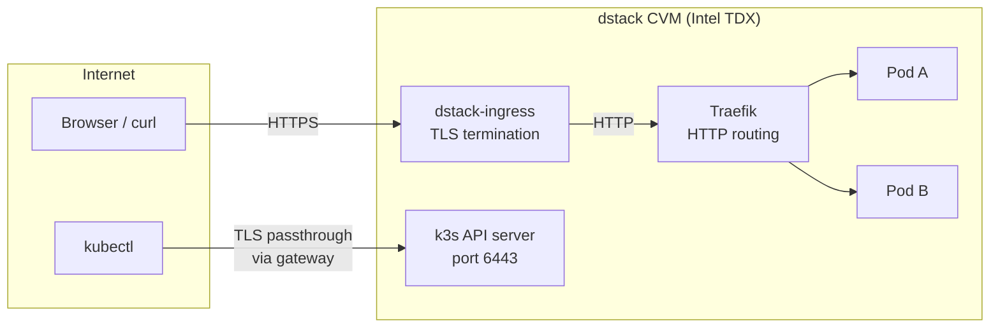

# k3s on dstack

Run a single-node Kubernetes cluster inside an Intel TDX Confidential VM with wildcard HTTPS for all your services.

## What You Get

- k3s cluster running in a hardware-isolated TEE
- Wildcard TLS certificate (Let's Encrypt) so every service gets HTTPS automatically
- Remote `kubectl` access through the dstack gateway
- Traefik ingress controller for routing HTTP traffic to pods

## Prerequisites

- [Phala Cloud](https://cloud.phala.network) account (or a self-hosted dstack deployment — see [Running on Raw dstack](#running-on-raw-dstack))
- Phala CLI installed and authenticated:
  ```bash
  npm install -g phala
  phala auth login
  ```
- `kubectl` and `jq` installed ([kubectl install guide](https://kubernetes.io/docs/tasks/tools/))
- A domain you control (for the wildcard certificate)
- Cloudflare API token with **Zone:Read** and **DNS:Edit** permissions (see [DNS_PROVIDERS.md](../custom-domain/dstack-ingress/DNS_PROVIDERS.md) for other DNS providers)

## Quick Start

The deploy script handles everything — CVM provisioning, kubeconfig extraction, certificate waiting, and a test workload:

```bash
export CLOUDFLARE_API_TOKEN=your-cloudflare-token
export CERTBOT_EMAIL=you@example.com

./deploy.sh k3s.example.com
```

Replace `k3s.example.com` with your actual domain. The script takes ~10 minutes (mostly waiting for the wildcard certificate). When done, it prints:

```
============================================
  k3s on dstack is ready!
============================================

  Kubeconfig:  export KUBECONFIG=/path/to/k3s.yaml
  kubectl:     kubectl get nodes
  Test URL:    https://nginx.k3s.example.com/
  Evidence:    https://nginx.k3s.example.com/evidences/quote
```

You can then deploy your own services:

```bash
export KUBECONFIG=k3s.yaml
kubectl run my-app --image=my-app:latest --port=8080
kubectl expose pod my-app --port=8080
kubectl apply -f - <<EOF
apiVersion: traefik.io/v1alpha1
kind: IngressRoute
metadata:
  name: my-app
spec:
  entryPoints: [web]
  routes:
    - match: Host(\`my-app.k3s.example.com\`)
      kind: Rule
      services:
        - name: my-app
          port: 8080
EOF
```

### Clean Up

Remove the test workload:

```bash
kubectl delete ingressroute.traefik.io nginx
kubectl delete svc nginx
kubectl delete pod nginx
```

Delete the CVM entirely:

```bash
echo y | phala cvms delete my-k3s
rm k3s.yaml
```

### Configuration

You can customize the deployment with environment variables:

| Variable | Default | Description |
|----------|---------|-------------|
| `CVM_NAME` | `my-k3s` | CVM name |
| `INSTANCE_TYPE` | `tdx.medium` | Instance type |
| `DISK_SIZE` | `50G` | Disk size |
| `KUBECONFIG_FILE` | `k3s.yaml` | Output kubeconfig path |

Example:

```bash
CVM_NAME=prod-k3s INSTANCE_TYPE=tdx.4xlarge DISK_SIZE=100G ./deploy.sh k3s.example.com
```

## Step-by-Step Guide

If you prefer to run each step manually instead of using the deploy script:

<details>
<summary>Click to expand manual steps</summary>

### 1. Deploy the CVM

```bash
phala deploy \
  -n my-k3s \
  -c docker-compose.yaml \
  -t tdx.medium \
  --disk-size 50G \
  --dev-os \
  -e "CLOUDFLARE_API_TOKEN=your-cloudflare-token" \
  -e "CERTBOT_EMAIL=you@example.com" \
  -e "CLUSTER_DOMAIN=k3s.example.com" \
  --wait
```

The `--dev-os` flag enables SSH access (needed to extract the kubeconfig). The `--disk-size 50G` gives enough room for k3s images and workloads.

The deploy command outputs an **App ID** and gateway info. Save the App ID (a 40-character hex string):

```
App ID: a1b2c3d4e5f6...
```

You can also retrieve these later:

```bash
phala cvms get my-k3s --json
```

### 2. Get Your Kubeconfig

Wait 3-4 minutes for the CVM to boot, then extract the kubeconfig:

```bash
APP_ID=<your-app-id>
GATEWAY_DOMAIN=<your-gateway-domain>   # e.g. dstack-pha-prod5.phala.network

# Find the gateway domain from the CVM info if you don't have it
# phala cvms get my-k3s --json | jq -r '.gateway.base_domain'

# Extract kubeconfig from the CVM
phala ssh "$APP_ID" -- \
  "docker exec dstack-k3s-1 cat /etc/rancher/k3s/k3s.yaml" \
  2>/dev/null > k3s.yaml

# Rewrite the API server URL to use the gateway TLS passthrough endpoint
sed -i "s|https://127.0.0.1:6443|https://${APP_ID}-6443s.${GATEWAY_DOMAIN}|" k3s.yaml

export KUBECONFIG=$(pwd)/k3s.yaml
```

> **Note:** The `-6443s` suffix tells the dstack gateway to use TLS passthrough (the `s` means passthrough). This way `kubectl` talks directly to the k3s API server's TLS — the gateway never sees the traffic contents.

### 3. Verify the Cluster

```bash
kubectl get nodes
```

Wait until the node shows `Ready` (1-2 minutes after SSH becomes available):

```
NAME       STATUS   ROLES                  AGE   VERSION
k3s-node   Ready    control-plane,master   2m    v1.31.6+k3s1
```

### 4. Wait for the Wildcard Certificate

The dstack-ingress container issues a Let's Encrypt wildcard certificate via DNS-01 challenge. This takes 5-8 minutes after CVM boot (certbot installation + 120s DNS propagation + issuance). If your domain has existing CAA records, the first attempt may fail and auto-retry after setting the correct `issuewild` CAA record.

Check with:

```bash
curl -sI "https://test.k3s.example.com/" 2>&1 | head -3
```

Retry until you see an HTTP response (a 404 is fine — it means TLS works but no service is routed yet):

```
HTTP/1.1 404 Not Found
```

### 5. Deploy a Test Workload

```bash
CLUSTER_DOMAIN=k3s.example.com

kubectl run nginx --image=nginx:alpine --port=80
kubectl expose pod nginx --port=80 --target-port=80 --name=nginx
kubectl wait --for=condition=Ready pod/nginx --timeout=120s

kubectl apply -f - <<EOF
apiVersion: traefik.io/v1alpha1
kind: IngressRoute
metadata:
  name: nginx
spec:
  entryPoints: [web]
  routes:
    - match: Host(\`nginx.${CLUSTER_DOMAIN}\`)
      kind: Rule
      services:
        - name: nginx
          port: 80
EOF

sleep 10
curl -s "https://nginx.${CLUSTER_DOMAIN}/"
```

You should see the nginx welcome page served over HTTPS with a valid Let's Encrypt certificate.

</details>

## How It Works

### Architecture



External HTTPS traffic hits dstack-ingress, which terminates TLS using the wildcard certificate and forwards plain HTTP to Traefik. Traefik routes requests to pods based on `Host` header matching via IngressRoutes.

`kubectl` connects through the dstack gateway's TLS passthrough mode (port suffix `-6443s`), so the gateway forwards encrypted traffic directly to the k3s API server without inspecting it.

### Services

| Service | Purpose |
|---------|---------|
| `kmod-installer` | Loads kernel modules required by k3s networking (runs once at boot) |
| `k3s` | Single-node k3s server running in privileged mode |
| `dstack-ingress` | Wildcard TLS termination via Let's Encrypt DNS-01, proxies to Traefik |

### How Wildcard HTTPS Works

1. dstack-ingress requests a wildcard certificate for `*.k3s.example.com` from Let's Encrypt using DNS-01 validation
2. It creates a DNS TXT record via the Cloudflare API to prove domain ownership
3. After certificate issuance, all HTTPS traffic to `*.k3s.example.com` is terminated by dstack-ingress
4. The decrypted HTTP traffic is forwarded to Traefik on port 80
5. Traefik matches the `Host` header against IngressRoute rules and routes to the right pod

## Environment Variables

| Variable | Required | Description |
|----------|----------|-------------|
| `CLOUDFLARE_API_TOKEN` | Yes | Cloudflare API token for DNS-01 certificate challenges |
| `CERTBOT_EMAIL` | Yes | Email for Let's Encrypt registration |
| `CLUSTER_DOMAIN` | Yes | Your domain for the wildcard cert (e.g., `k3s.example.com`) |
| `K3S_NODE_NAME` | No | Kubernetes node name (default: `k3s-node`) |

The following are auto-injected by Phala Cloud and used in the compose file:

| Variable | Description |
|----------|-------------|
| `DSTACK_APP_ID` | CVM application ID (used for k3s TLS SAN) |
| `DSTACK_GATEWAY_DOMAIN` | Gateway domain (used for k3s TLS SAN and ingress routing) |

### Using a Different DNS Provider

The compose file defaults to Cloudflare. To use a different provider, change `DNS_PROVIDER` and the corresponding credentials. See [DNS_PROVIDERS.md](../custom-domain/dstack-ingress/DNS_PROVIDERS.md) for supported providers (Linode, Namecheap, Route53).

### Instance Sizing

| Instance Type | Recommended For |
|---------------|-----------------|
| `tdx.medium` | Testing and tutorials |
| `tdx.4xlarge` | Small production workloads (5-10 pods) |
| `tdx.8xlarge` | Larger workloads |

k3s itself uses ~500MB RAM. Budget the rest for your workloads. A 50GB disk is recommended minimum.

## Hardening (Optional)

### Scoped RBAC for Programmatic Access

The kubeconfig from step 2 uses the built-in `cluster-admin` credentials. For programmatic access with limited permissions, create a scoped service account:

```bash
kubectl apply -f manifests/rbac.yaml
kubectl create token k3s-admin --duration=8760h
```

Use the resulting token with the API server URL from your kubeconfig.

### Network Policies

Restrict pod-to-pod traffic so pods can only receive traffic from Traefik and reach the internet (but not each other):

```bash
kubectl apply -f manifests/network-policy.yaml
```

This applies three policies:
- **default-deny**: blocks all ingress and egress by default
- **allow-internet-egress**: allows outbound internet (but blocks pod-to-pod via CIDR exclusions) and DNS
- **allow-traefik-ingress**: allows inbound traffic only from Traefik in kube-system

## Running on Raw dstack

This tutorial targets Phala Cloud, but the same compose file works on a self-hosted dstack deployment. Key differences:

- `DSTACK_APP_ID` and `DSTACK_GATEWAY_DOMAIN` are not auto-injected. Add a `K3S_TLS_SAN` environment variable to the k3s service manually with your gateway endpoint, and update the `--tls-san` argument.
- Deploy via the VMM web UI (port 9080) or `vmm-cli.py` instead of the Phala CLI.
- See the [dstack deployment guide](https://github.com/Dstack-TEE/dstack/blob/main/docs/deployment.md) for self-hosted setup.

## Timing Reference

| Phase | Duration |
|-------|----------|
| CVM provision | ~1s |
| SSH available | ~2-3 min |
| k3s node Ready | ~1 min after SSH |
| Wildcard cert issued | ~5-8 min (certbot install + DNS propagation) |
| **Total to first HTTPS 200** | **~8-10 min** |

Measured on `tdx.medium` with 50GB disk. The wildcard cert is the bottleneck — certbot installs its dependencies on first boot, then waits 120s for DNS propagation. If your domain has existing CAA records, add another ~3 min for the auto-retry.

## Troubleshooting

**kubectl connection refused**
The k3s API server may not be ready yet. Wait 3-5 minutes after deploy, then retry. Check that the `--tls-san` value matches your gateway endpoint.

**Wildcard cert not issuing**
Check dstack-ingress logs:
```bash
phala ssh <app-id> -- "docker logs dstack-dstack-ingress-1 2>&1 | tail -30"
```
Common causes: wrong Cloudflare token, domain not on your Cloudflare account, DNS propagation delay, existing CAA records (auto-retried).

**IngressRoute returns 404**
Traefik may not have picked up the route yet. Wait 10-15 seconds and retry. Verify the IngressRoute exists:
```bash
kubectl get ingressroute.traefik.io
```

**Node stuck in NotReady**
The kmod-installer may have failed. Check k3s logs:
```bash
phala ssh <app-id> -- "docker logs dstack-k3s-1 2>&1 | tail -30"
```

## Files

```
k3s/
├── docker-compose.yaml          # k3s + kmod-installer + dstack-ingress
├── deploy.sh                    # One-command deploy + setup
├── README.md
└── manifests/
    ├── rbac.yaml                # Optional: scoped service account
    └── network-policy.yaml      # Optional: restrict pod traffic
```
